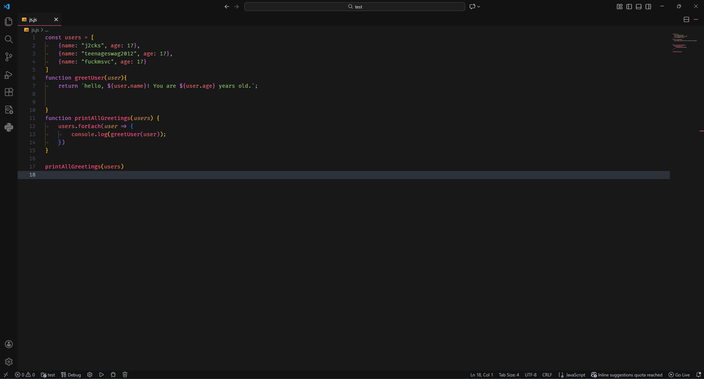
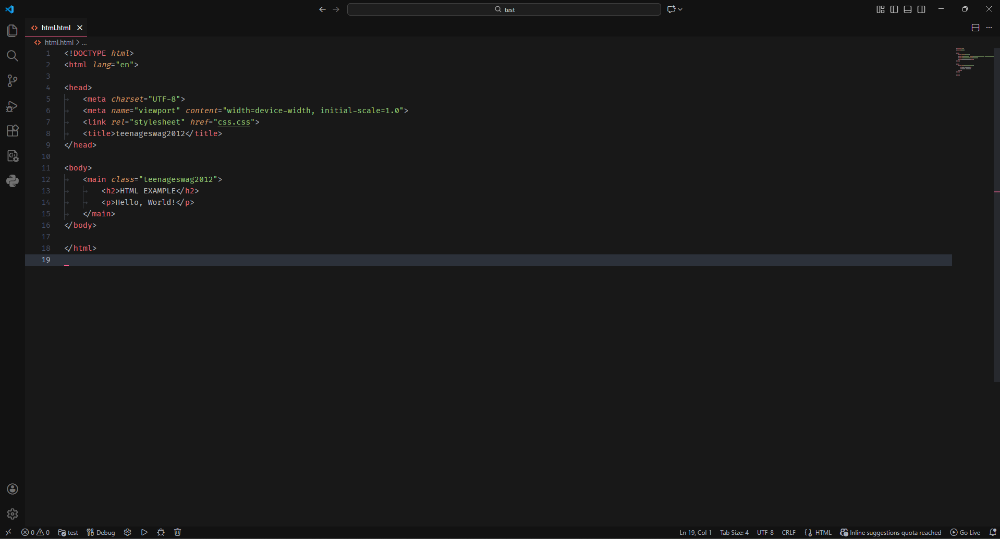
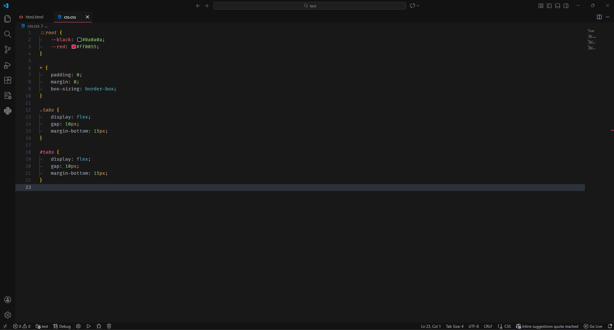

# ☢️ Nuclear Hippie Theme

<p align="center">
  
  <br>
  <b>A high-contrast, harmonious dark theme for VS Code.</b>
  <br>
  <i>Designed for long coding sessions with a touch of radioactive elegance.</i>
</p>

<p align="center">
  <a href="https://marketplace.visualstudio.com/items?itemName=j2cks.nuclear-hippie">
    
  </a>
  <a href="https://marketplace.visualstudio.com/items?itemName=j2cks.nuclear-hippie">
    
  </a>
  <a href="https://github.com/mcagampan/nuclear-hippie/blob/master/LICENSE">
    
  </a>
</p>

---

## ✨ Features

- **🎨 Harmonious Palette**: A soft, neutral dark grey background (`#181818`) paired with vibrant Pink/Crimson accents (`#FF5C8D`) and Atom-inspired syntax colors.
- **👀 Eye Comfort**: Carefully balanced contrast to reduce eye strain during late-night coding marathons.
- **🚀 Unified Design**: Consistent styling across the Editor, Sidebar, Terminal, and Activity Bar.
- **⚡ Syntax Support**: Optimized for JavaScript, TypeScript, CSS, HTML, C++, Go, Python, and more.

## 🖼️ Screenshots

| JavaScript / TypeScript | HTML / CSS |
|:---:|:---:|
|  |  |
| **C++** | **CSS** |
|  |  |

## 🚀 Installation

### Via VS Code Marketplace
1. Open **VS Code**.
2. Go to **Extensions** (`Ctrl+Shift+X` or `Cmd+Shift+X`).
3. Search for `Nuclear Hippie`.
4. Click **Install**.
5. Select the theme via **File > Preferences > Color Theme** > **Nuclear**.

### Manual Installation (.vsix)
1. Download the latest `.vsix` release.
2. Open VS Code extensions panel.
3. Click the `...` menu (Views and More Actions).
4. Select **Install from VSIX...**
5. Choose the downloaded file.

## ⚙️ Recommended Settings

To get the best experience, we recommend adding these settings to your `settings.json`:

```json
{
  "editor.renderLineHighlight": "all",
  "editor.cursorBlinking": "smooth",
  "editor.cursorSmoothCaretAnimation": "on",
  "workbench.item.customizations": {
    "statusBar.item.hoverBackground": "#FF5C8D"
  }
}
```

## ❤️ Contributing

Found a bug or have a suggestion? Feel free to open an issue or submit a pull request on [GitHub](https://github.com/mcagampan/nuclear-hippie).

---

<p align="center">
  Made with ☢️ by <a href="https://github.com/j2cks">j2cks</a>
</p>
